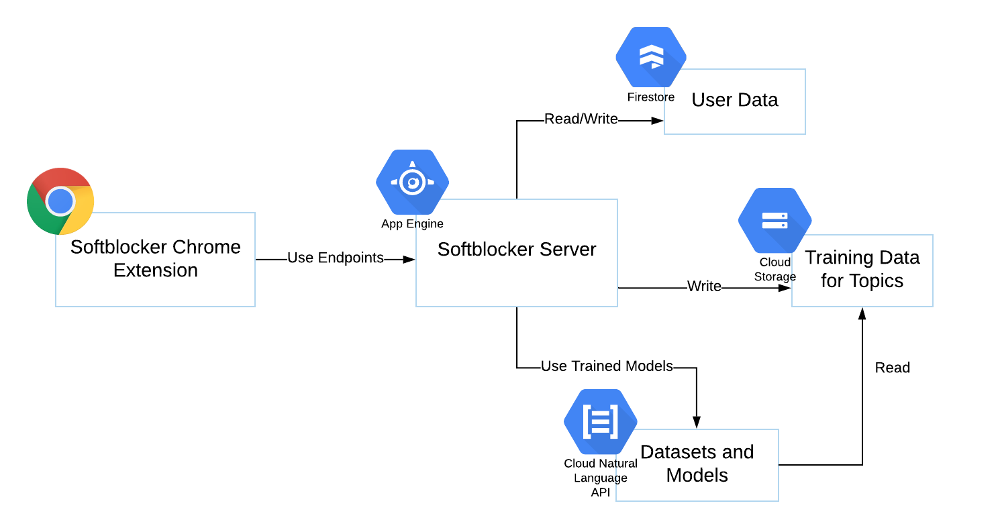

# Softblocker Server

## Design
### System

### Database Schema
ID of the document is the user/profile ID. The following is the schema of each document:
```
datasetId: String,
modelId: String,
topics: Map{ 
  topic_name: Map{ 
    isInTraining: Boolean, 
    isTrained: Boolean
  } 
}
```

## Setup
Put GCP service account key file (a `.json` file) in the root of the folder.

Run the following commands:
```
export GOOGLE_APPLICATION_CREDENTIALS=<PATH_TO_KEY_FILE>
export PROJECT_ID="softblocker"
export REGION_NAME="us-central1"        
```

## Running on GCP App Engine

Create an `app.yaml` in the root of the folder to store the configurations of the service for App Engine. Set `GOOGLE_APPLICATION_CREDENTIALS` to the relative path (w.r.t. the root of the folder) of the service account key file.

Sample `app.yaml`:
```
runtime: nodejs12

env_variables:
  GOOGLE_APPLICATION_CREDENTIALS: <PATH_TO_KEY_FILE>
  PROJECT_ID: "softblocker"
  REGION_NAME: "us-central1"
```

To upload the project source code to App Engine, run
```
gcloud app deploy --stop-previous-version
```

To tail the logs, run
```
gcloud app logs tail -s default
```
